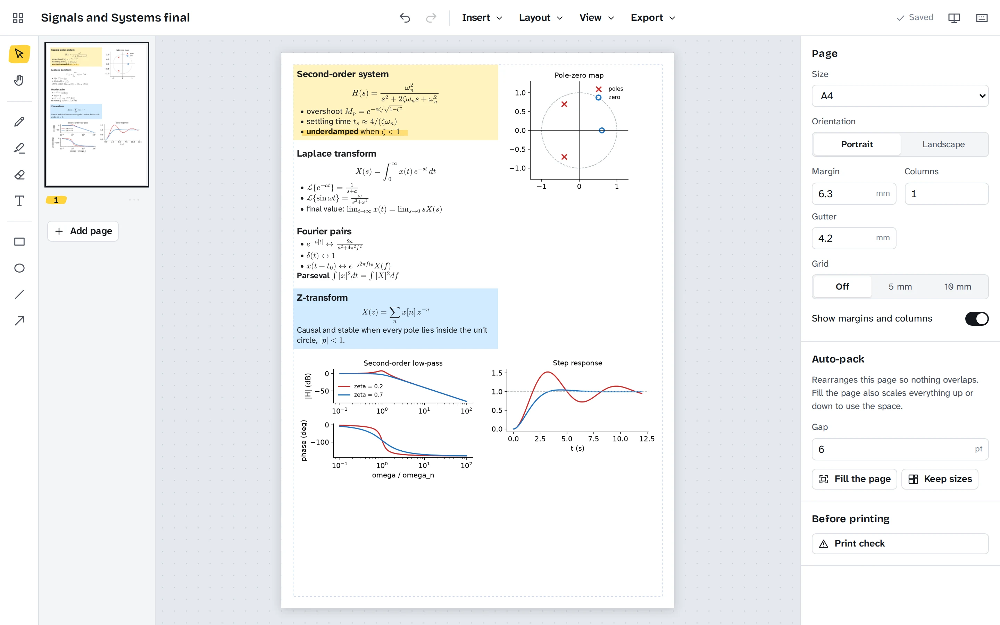
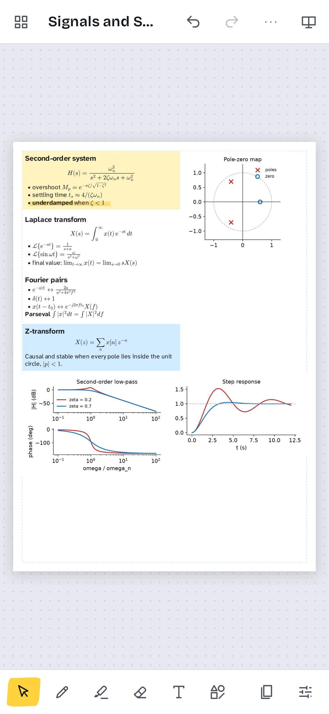

<p align="center">
  
</p>

<h1 align="center">Cheatsheet Maker</h1>

<picture>
  <source media="(prefers-color-scheme: dark)" srcset="docs/img/editor-dark.webp">
  
</picture>

Cheatsheet Maker turns screenshots, lecture slides, notes and formulas into one
dense, printable page. Paste a screenshot or cut a region straight out of a
lecture PDF, type notes with LaTeX, draw and highlight, then let auto-pack fit
everything onto the page and export a PDF.

It runs in the browser and installs from it on any computer or phone, and it
ships as native apps for Windows, macOS, Linux and Android. There is no account
and no server: your sheets stay on your device.

Project site: <https://danieltyukov.github.io/cheatsheet-maker/>

## What it is

An editor for one kind of document: the single sheet you are allowed into an
exam. Everything on the page is a box you can move, resize, rotate and crop, and
the tools are the ones that make a page dense without making it unreadable.

- **Paste, drop or import images.** Ctrl+V a screenshot, drop files on the page,
  or take a photo with your phone. Double-click an image to crop it; the rest of
  the image is kept, so a crop can be widened again later.
- **Slides straight from the PDF.** Open a lecture PDF, flip to a slide, drag a
  box around what you need and add it. The page is stored once, at the
  resolution you choose, and each box is a crop of it.
- **Text with math.** Text boxes take a small Markdown subset (headings, bold,
  italic, code, lists) and LaTeX: `$\frac{a}{b}$` inline and `$$...$$` for a
  centred formula, typeset by MathJax.
- **Auto-pack.** Fill the page scales everything by one factor, as far as it
  fits, with nothing overlapping. Keep sizes packs tightly and spills onto a new
  page.
- **Ink saver.** Turn white backgrounds transparent, invert dark-theme slides,
  go grayscale, raise the contrast, or trim the empty margins off a screenshot.
- **Drawing.** A pressure-sensitive pen, a highlighter that multiplies over the
  ink, an eraser, rectangles, ellipses, lines and arrows.
- **Layout.** Snap guides, a grid, column guides, rotation, align and
  distribute, layers, and page sizes from A5 to A3 in either orientation.
- **Print check.** Lists images that will print below 150 DPI and text smaller
  than 5 pt, and shows the page at its real size.

Your sheets live in a library on the device. A sheet can be saved as a
`.cheatsheet` file (a zip of the document and its images) to back it up or open
it somewhere else.



## Install

Downloads are on the
[releases page](https://github.com/danieltyukov/cheatsheet-maker/releases/latest).

**Web.** Open <https://danieltyukov.github.io/cheatsheet-maker/app/> in Chrome,
Edge, Firefox or Safari. It works offline after the first visit. In Chrome and
Edge, the install button in the address bar adds it to your apps.

**Windows.** `CheatsheetMaker_x64-setup.exe` installs for the current user with
no admin prompt and fetches the WebView2 runtime if the machine lacks it. The
installer is not code-signed, so SmartScreen asks once: More info, then Run
anyway. `CheatsheetMaker_x64.msi` is the same build for anyone who deploys with
MSI.

**macOS.** `CheatsheetMaker_universal.dmg` runs on Apple silicon and Intel. It
is ad-hoc signed but not notarised, so the first launch needs a right-click on
the app and Open, or System Settings, Privacy and Security, Open Anyway.

**Linux.** `cheatsheet-maker_x86_64.AppImage` runs anywhere: `chmod +x` it and
run it. `cheatsheet-maker_amd64.deb` is there for Debian and Ubuntu, installed
with `sudo apt install ./cheatsheet-maker_amd64.deb`. Both are built on Ubuntu
22.04, so they run on older systems as well as newer ones.

**Android.** `cheatsheet-maker.apk` needs Android 7 or newer. Android asks you
to allow installs from your browser, once.

**iPhone and iPad.** Open the web app in Safari, tap Share, then Add to Home
Screen. It opens full screen and works offline.

`SHA256SUMS` next to the downloads lists a checksum for every file.

## First sheet

1. **Collect.** Paste screenshots, use Insert, From a PDF for lecture slides, and
   press T for a text box with the formulas you keep forgetting.
2. **Arrange.** Layout, Auto-pack: fill the page. Move what matters to the top
   and highlight the traps.
3. **Check.** Export, Print check, and fix anything it lists.
4. **Print.** Export, PDF, and print at 100%, not "fit to page".

## Keyboard shortcuts

On macOS, Cmd replaces Ctrl. Press `?` in the app for the full list.

| Keys | Action |
| --- | --- |
| V, H, P, M, E, T | Select, hand, pen, highlighter, eraser, text |
| R, O, L, A | Rectangle, ellipse, line, arrow |
| C | Crop the selected image |
| Ctrl+Z, Ctrl+Shift+Z | Undo, redo |
| Ctrl+C, Ctrl+X, Ctrl+V, Ctrl+D | Copy, cut, paste, duplicate |
| Arrows, Shift+arrows | Nudge 1 pt, 10 pt |
| Ctrl+] and Ctrl+[ | Forward, backward (with Shift: to front, to back) |
| Ctrl+O, Ctrl+Shift+O | Import images, import from a PDF |
| Ctrl+E, Ctrl+Shift+E, Ctrl+S | Export PDF, export PNG, save a .cheatsheet file |
| Ctrl+plus, Ctrl+minus, Ctrl+0, Ctrl+1 | Zoom in, out, actual size, fit the page |
| Ctrl+Enter | Add a page |

## Coming from the old Linux version

Cheatsheet Maker started as a GTK3 app in C. That version is kept at the
`v0-gtk` tag. Its work lived in `~/.config/cheatsheet-maker/autosave.json`: the
Linux desktop app finds that file on first launch and offers to import it, and
on any other platform you can open it with Open file on the library screen.

## Build from source

Requires Node 22 with npm 10 or newer, and a Rust toolchain from rustup for the
native apps.

```
git clone https://github.com/danieltyukov/cheatsheet-maker.git
cd cheatsheet-maker
npm ci
npm run dev           # the web app at http://localhost:5173
npm test              # unit and component tests
npm run e2e -w app    # Playwright against the built web app
```

The native apps build from `app/`:

```
npx tauri build --bundles deb,appimage                          # Linux
npx tauri build --bundles nsis,msi                              # Windows
npx tauri build --target universal-apple-darwin --bundles dmg   # macOS
npx tauri android build --apk --target aarch64 --target x86_64  # Android
```

The Linux build needs
`libwebkit2gtk-4.1-dev build-essential curl wget file libxdo-dev libssl-dev libayatana-appindicator3-dev librsvg2-dev`.
The Android build needs JDK 21, the Android SDK and NDK, and `NDK_HOME` pointing
at the NDK. `CONTRIBUTING.md` has the details.

## Repository layout

    app/src/model/     the document, edits, undo, auto-pack, snapping, the file
                       format. Plain TypeScript with no DOM, tested on its own.
    app/src/render/    one page renderer for screen, thumbnails and export;
                       Markdown and MathJax, image filters, PDF and PNG export
    app/src/storage/   the IndexedDB library and autosave
    app/src/platform/  file dialogs for the web and for Tauri
    app/src/ui/        React: the editor, the canvas, the library
    app/src-tauri/     the Tauri shell for desktop and Android
    app/e2e/           Playwright tests of the built web app
    site/              the project website
    docs/              architecture, file format, screenshots, specs and plans
    scripts/           icons, screenshots, version and release-note helpers

## Documentation

- `docs/ARCHITECTURE.md`, how the pieces fit and why
- `docs/FILE-FORMAT.md`, the `.cheatsheet` format, field by field
- `CONTRIBUTING.md`, setting up, testing and sending changes
- `PRIVACY.md`, what is stored and where
- `SECURITY.md`, how to report a vulnerability

## Licence

MIT, in `LICENSE`. The bundled fonts (Atkinson Hyperlegible Next, Archivo
Narrow, Source Serif 4, JetBrains Mono and Bricolage Grotesque) are under the SIL
Open Font License.
